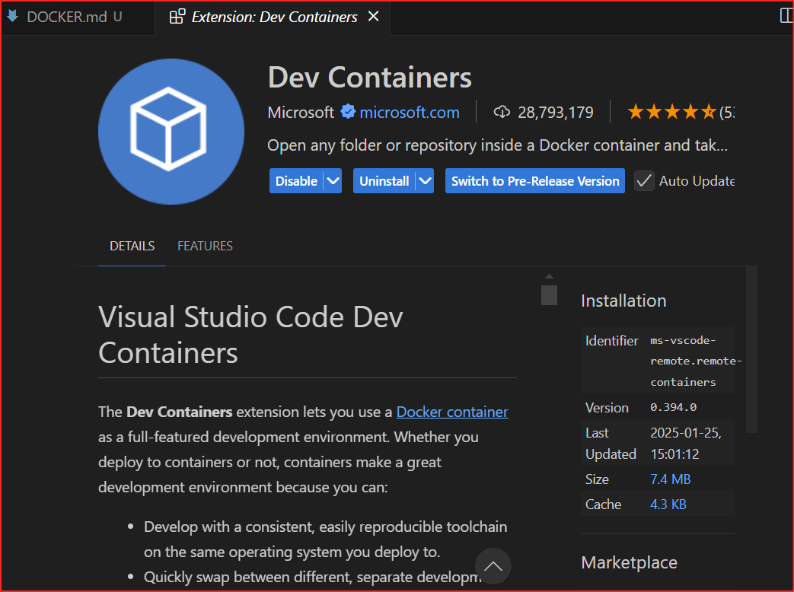
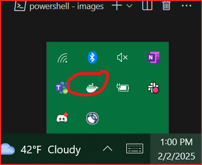
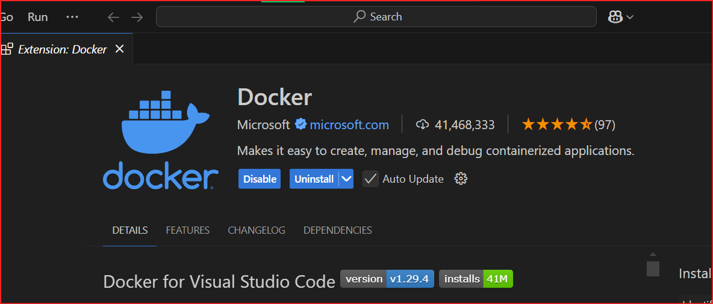

# Docker Setup #

### Updated 2/2/2025 ###

Download Docker Desktop [here](https://desktop.docker.com/win/main/amd64/Docker%20Desktop%20Installer.exe?utm_source=docker&utm_medium=webreferral&utm_campaign=dd-smartbutton&utm_location=module&_gl=1*xf6xu7*_gcl_au*MTg3NTAyMTc1Mi4xNzM3ODM2MDU5*_ga*MzU2Mjg2NjQ0LjE3Mzc4MzYwNjA.*_ga_XJWPQMJYHQ*MTczODQ1MjU0My43LjEuMTczODQ1MjU0Ny41Ni4wLjA.):

Download the Dev Containers extension [here](https://marketplace.visualstudio.com/items?itemName=ms-vscode-remote.remote-containers)

If it seems like your docker desktop is not working, it may be running in the background. Hit the sidebar and you should see a docker logo.

Run the command to reopen in a dev container. 

Use `"docker ps"` to list any open containers.  
If you have an open container, it will **STAY OPEN** in the background.  
If the container is not closing, use `"docker kill <container_id>"`, where `container_id` is found using `docker ps`.

 

An optional extension to have would be the Docker extension in the extensions [tab](https://marketplace.visualstudio.com/items?itemName=ms-azuretools.vscode-docker): 

